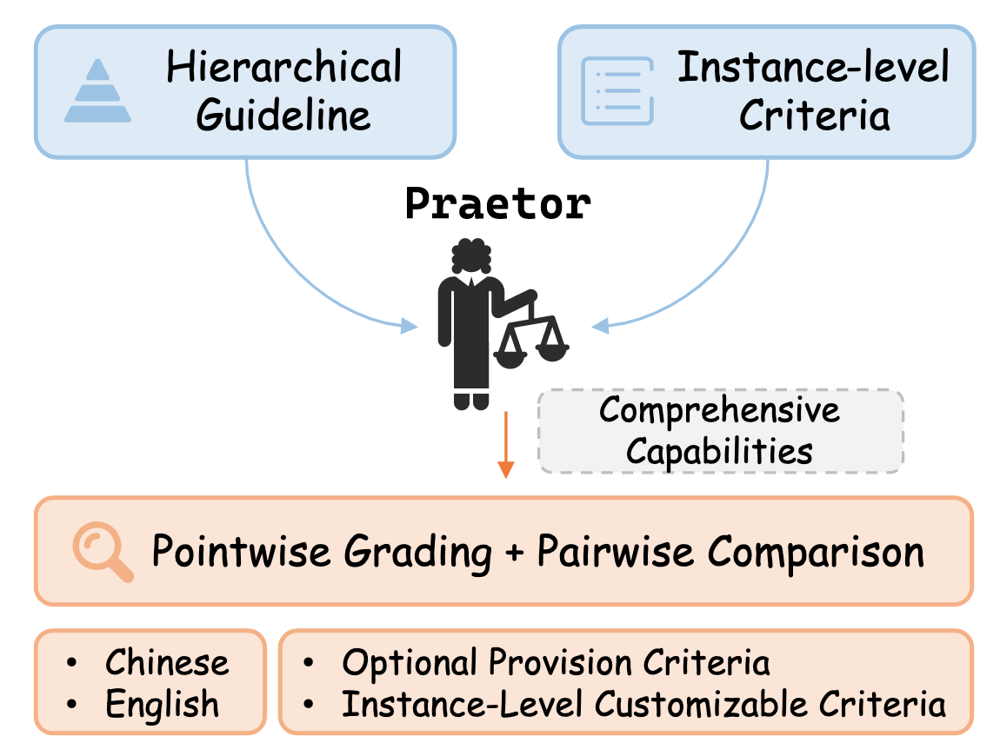
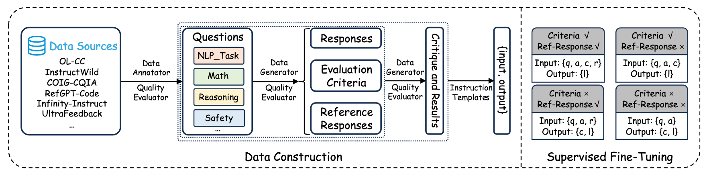

<h1 align="center">Praetor: A Fine-Grained Generative LLM Evaluator with Instance-Level Customizable Evaluation Criteria</h1>

## Introduction
With the increasing capability of large language models (LLMs), LLM-as-a-judge has emerged as a new evaluation paradigm. Compared with traditional automatic and manual evaluation, LLM evaluators exhibit better interpretability and efficiency. Despite this, existing LLM evaluators suffer from limited use scenarios and poor flexibility. To mitigate these issues, we propose Praetor, a fine-grained generative LLM evaluator with instance-level customazable evaluation criteria. To train Praetor, we curate a large-scale dataset guided with a hierarchical guideline covering a wide range of tasks and instance-level evaluation criteria. We train Praetor on this dataset in a multi-task learning fashion, which enables to evaluate LLMs in either pointwise grading or pairwise comparison way and support two languages simultaneously with a high flexibility of setting evaluation criteria. Extensive experiments demonstrate that Praetor outperforms previous LLM evaluators and instruction-tuned LLMs on multiple benchmarks, setting new SOTA results. It also exhibits the potential for generating critiques as scalable feedback to further improve LLMs.

## Overview

Figure 1: Praetor is a Chinese and English LLM evaluator that supports both pointwise grading and pairwise comparison with high flexibility.


Figure 2: Illustration of the data construction pipeline and training method for Praetor. $q$, $a$, $c$, $r$ and $l$ denote question, response, evaluation criteria, reference response, and critique and result, respectively.

## Usage

### Model
Our model is now available on huggingface hub: [Praetor-7B](https://huggingface.co/sdsxdxl/Praetor-7B)

### Dataset
Our dataset is now available on huggingface hub: [Praetor_trainset](https://huggingface.co/datasets/sdsxdxl/Praetor_trainset)

### Evaluation
The instruction templates for various evaluation modes can be found in prompt_template.py
```python
python inference.py
```